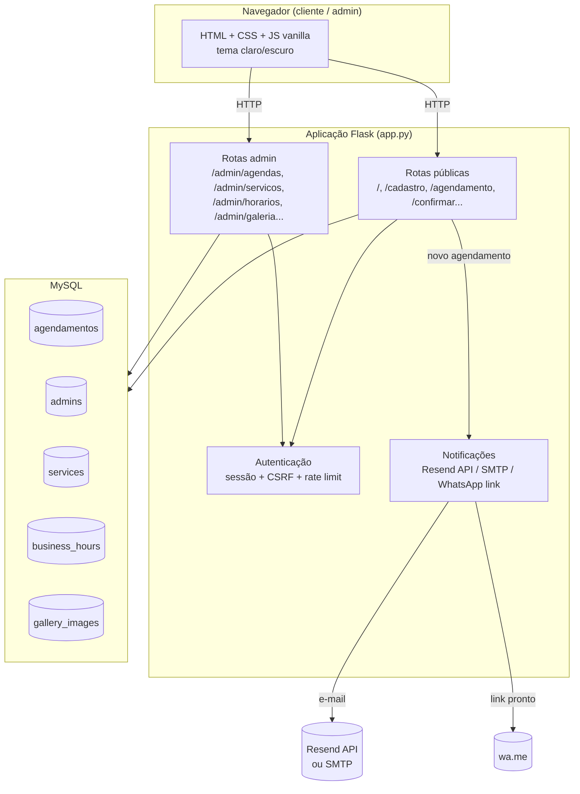

<div align="center">

# ✂️ Danilo Barbearia

**Sistema completo de agendamento e gestão para barbearias** — do agendamento do cliente ao dashboard administrativo, construído com Flask e MySQL.

[](https://www.python.org/)
[](https://flask.palletsprojects.com/)
[](https://www.mysql.com/)
[](https://railway.app/)
[](#-temas-claro--escuro)

</div>

---

## 📖 Visão geral

**Danilo Barbearia** é uma aplicação web full-stack para barbearias que precisam de um sistema de agendamento online sem depender de planilhas, grupos de WhatsApp ou papel. O cliente agenda sozinho pelo site; o administrador gerencia tudo — agenda, serviços, preços, horário de funcionamento e galeria de fotos — por um painel próprio, sem precisar tocar em código ou banco de dados.

O projeto nasceu como um sistema simples de agendamento e evoluiu para algo próximo de um **mini-SaaS de gestão**: autenticação com recuperação de senha, proteção contra força bruta, dashboard com KPIs e gráficos, notificação automática por e-mail a cada novo agendamento, e confirmação via WhatsApp para o cliente — tudo com uma interface responsiva com tema claro/escuro.

> 🔗 **Demo ao vivo:** [danilobarbearia-production.up.railway.app](https://danilobarbearia-production.up.railway.app)

---

## 📑 Sumário

- [Funcionalidades](#-funcionalidades)
- [Arquitetura](#-arquitetura)
- [Stack tecnológica](#-stack-tecnológica)
- [Estrutura do projeto](#-estrutura-do-projeto)
- [Como rodar localmente](#-como-rodar-localmente)
- [Variáveis de ambiente](#-variáveis-de-ambiente)
- [Modelo de dados](#-modelo-de-dados)
- [Segurança](#-segurança)
- [Rotas principais](#-rotas-principais)
- [Temas claro / escuro](#-temas-claro--escuro)
- [Deploy](#-deploy)
- [Testes](#-testes)
- [Roadmap](#-roadmap)
- [Licença](#-licença)

---

## ✨ Funcionalidades

### Para o cliente
- Cadastro rápido (nome + telefone, sem senha) e agendamento em poucos cliques
- Disponibilidade de horários em tempo real, calculada a partir do horário de funcionamento configurado pelo admin — sem conflito de duplo agendamento (lock a nível de transação no banco)
- Limite de 2 agendamentos simultâneos por cliente (evita que um único número monopolize a agenda)
- Cancelamento e reagendamento pelo próprio cliente
- Confirmação com link de **WhatsApp pré-preenchido** — o cliente só clica em enviar
- Interface com **tema claro/escuro**, persistente entre visitas

### Para o administrador
- **Dashboard** com KPIs (agendamentos do dia/semana, receita do mês, clientes únicos, serviço mais popular, próximo horário), agenda do dia em timeline, gráfico de tendência de 14 dias e distribuição de serviços em donut chart
- Cancelamento de qualquer agendamento direto pelo painel, com contato de um clique (ligar / WhatsApp)
- **Gestão de serviços e preços** pela própria tela — sem precisar editar código ou redeployar
- **Horário de funcionamento configurável** por dia da semana (abre/fecha/intervalo/fechado), refletido automaticamente na disponibilidade mostrada ao cliente
- **Galeria de fotos** com upload/remoção pelo painel
- Relatório por período com receita, serviço mais agendado e gráficos de receita/agendamentos por dia

### Autenticação e notificações
- Login de administrador com **limitador de tentativas** (proteção contra força bruta)
- **Recuperação de senha por código** — gerado uma única vez, hash salvo no banco, sem depender de e-mail/SMS para o fluxo básico de login
- **Notificação automática por e-mail** ao admin a cada novo agendamento, com dois caminhos de envio: API HTTP (Resend) como preferencial e SMTP direto como alternativa — o sistema funciona normalmente mesmo sem nenhum dos dois configurado

---

## 🏗️ Arquitetura

Aplicação monolítica Flask server-side rendered (Jinja2), sem front-end separado — o que mantém o deploy simples (um único serviço) e reduz a superfície de coisas que podem quebrar.



Um detalhe de engenharia que vale destacar: **as tabelas e colunas novas são criadas automaticamente** na primeira execução (padrão `CREATE TABLE IF NOT EXISTS` + seed condicional, e `ALTER TABLE` verificando `information_schema` antes de alterar). Isso permite evoluir o schema sem exigir uma migração manual antes de cada deploy — o próprio código se adapta a um banco de produção mais antigo.

---

## 🛠️ Stack tecnológica

| Camada | Tecnologia |
|---|---|
| Backend | Python 3 + [Flask](https://flask.palletsprojects.com/) |
| Banco de dados | MySQL 8 (via `mysql-connector-python`) |
| Front-end | Jinja2 + CSS puro (custom properties para tema) + JavaScript vanilla (sem frameworks/bundlers) |
| Autenticação | Sessão Flask + hash SHA-256 (com suporte legado a Werkzeug) + CSRF por token de sessão |
| E-mail | [Resend](https://resend.com) (API HTTP) com fallback para SMTP (`smtplib`) |
| Servidor WSGI (produção) | Gunicorn |
| Hospedagem | Railway (app + MySQL) |

Escolha deliberada: **zero dependências de front-end pesadas** (sem React/build step) — todo o dinamismo de UI (combobox de horários, tema, dashboard) é JavaScript vanilla direto, o que mantém o projeto simples de rodar e de dar manutenção para uma aplicação deste porte.

---

## 📂 Estrutura do projeto

```
DaniloBarbearia/
├── app.py                     # Aplicação Flask — rotas, regras de negócio, segurança
├── conexao.py                 # Conexão com o MySQL
├── requirements.txt
├── Procfile                   # Comando de start em produção (gunicorn)
├── .env.example                # Template de variáveis de ambiente
├── static/
│   ├── styles/style.css       # Design system (tokens de tema claro/escuro)
│   ├── js/main.js             # Combobox de horários, tema, validações client-side
│   ├── images/                # Ilustrações dos serviços
│   └── uploads/gallery/       # Fotos enviadas pelo admin (gerado em runtime)
├── templates/
│   ├── index.html, agendamento.html, confirmacao.html, meus_agendamentos.html, alterar.html
│   └── admin_*.html           # Login, dashboard, serviços, horários, galeria, recuperação de senha
├── tests/
│   └── test_normalize_name.py
└── scripts/
    └── check_normalize_name.py
```

---

## 🚀 Como rodar localmente

**Pré-requisitos:** Python 3.11+, MySQL 8 rodando localmente (ou acessível).

```bash
# 1. Clone o repositório
git clone https://github.com/KelvynNeris/DaniloBarbearia.git
cd DaniloBarbearia

# 2. Crie e ative um ambiente virtual
python -m venv .venv
.venv\Scripts\activate          # Windows
# source .venv/bin/activate     # Linux/macOS

# 3. Instale as dependências
pip install -r requirements.txt

# 4. Configure as variáveis de ambiente
copy .env.example .env          # Windows
# cp .env.example .env          # Linux/macOS
# edite o .env com as credenciais do seu MySQL local

# 5. Rode a aplicação
python app.py
```

Acesse **http://localhost:8080**. Na primeira execução, um administrador padrão é criado automaticamente:

| Usuário | Senha |
|---|---|
| `adm` | `123` |

No primeiro login você será direcionado para definir uma senha nova antes de continuar. As tabelas (`agendamentos`, `admins`, `services`, `business_hours`, `gallery_images`) e os serviços padrão são criados/populados automaticamente — não é preciso rodar nenhum script SQL manualmente.

---

## ⚙️ Variáveis de ambiente

| Variável | Obrigatória | Descrição |
|---|:---:|---|
| `DB_HOST`, `DB_USER`, `DB_PASSWORD`, `DB_NAME`, `DB_PORT` | ✅ | Credenciais de conexão com o MySQL |
| `SECRET_KEY` | ✅ | Chave secreta do Flask (sessões e CSRF) |
| `FLASK_DEBUG` | – | `true`/`false` — nunca `true` em produção |
| `PORT` | – | Porta do servidor (padrão `8080`) |
| `ADMIN_NOTIFY_EMAIL` | – | E-mail que recebe o aviso de novo agendamento |
| `RESEND_API_KEY` | – | Ativa o envio de e-mail via [Resend](https://resend.com) (recomendado — não depende de porta SMTP liberada) |
| `RESEND_FROM` | – | Remetente no Resend (padrão `onboarding@resend.dev`) |
| `SMTP_HOST`, `SMTP_PORT`, `SMTP_USER`, `SMTP_PASSWORD`, `SMTP_FROM` | – | Alternativa via SMTP direto (ex.: Gmail com senha de app) |

Nenhuma variável de e-mail é obrigatória — sem elas, o sistema funciona normalmente e só não envia a notificação.

Veja [`.env.example`](.env.example) para o template completo.

---

## 🗄️ Modelo de dados

| Tabela | Descrição |
|---|---|
| `agendamentos` | Agendamentos — data, horário, cliente, serviço. Trava única em `(date, time)` |
| `admins` | Administradores — credenciais, telefone, flag de primeiro acesso, hash do código de recuperação |
| `services` | Catálogo de serviços — nome, descrição, preço, imagem, ativo/inativo |
| `business_hours` | Horário de funcionamento por dia da semana |
| `gallery_images` | Fotos da galeria exibidas na página inicial |

Todas as tabelas e colunas são criadas/migradas automaticamente pela própria aplicação na primeira execução — o schema evolui junto com o código.

---

## 🔐 Segurança

- **CSRF**: token por sessão validado em todo formulário que altera estado
- **Senhas**: hash SHA-256 (com verificação de compatibilidade para hashes legados do Werkzeug)
- **Rate limiting**: bloqueio temporário após tentativas de login malsucedidas (por IP + usuário), em memória — sem infraestrutura extra
- **Recuperação de senha**: código de recuperação de alta entropia, mostrado **uma única vez**, armazenado apenas como hash (nunca em texto puro) e rotacionado a cada uso
- **Uploads**: validação de extensão, limite de tamanho e nome de arquivo gerado (`uuid4`) para a galeria de fotos
- **Sessões**: cookies `HttpOnly` (padrão do Flask)

---

## 📡 Rotas principais

<details>
<summary><strong>Cliente</strong></summary>

| Rota | Método | Descrição |
|---|---|---|
| `/` | GET | Página inicial — serviços, galeria, horário |
| `/cadastro` | POST | Cadastro do cliente (nome + telefone) |
| `/agendamento` | GET | Escolha de serviço, data e horário |
| `/confirmar` | POST | Confirma o agendamento |
| `/ocupados` | GET | JSON com horários ocupados/permitidos para uma data |
| `/confirmacao` | GET | Tela de confirmação + link de WhatsApp |
| `/meus_agendamentos` | GET | Lista os agendamentos do cliente |
| `/cancelar`, `/alterar` | POST/GET | Cancelar ou remarcar um agendamento |

</details>

<details>
<summary><strong>Administração</strong></summary>

| Rota | Método | Descrição |
|---|---|---|
| `/admin/login` | GET/POST | Login do administrador |
| `/admin/recuperar` | GET/POST | Recuperação de senha por código |
| `/admin/change` | GET/POST | Dados da conta ("Minha conta") |
| `/admin/agendas` | GET | Dashboard — KPIs, agenda, gráficos |
| `/admin/relatorio` | GET | Relatório por período |
| `/admin/servicos` | GET/POST | Gestão de serviços e preços |
| `/admin/horarios` | GET/POST | Horário de funcionamento |
| `/admin/galeria` | GET/POST | Upload/remoção de fotos |
| `/admin/cancelar` | POST | Cancela qualquer agendamento |

</details>

---

## 🎨 Temas claro / escuro

Todo o design system é construído sobre **CSS custom properties**, com três camadas de precedência:

1. Tema claro por padrão (`:root`)
2. Segue a preferência do sistema operacional (`prefers-color-scheme`)
3. Escolha explícita do usuário via botão no cabeçalho, persistida em `localStorage`

Isso garante que a UI nunca "pisque" no tema errado ao carregar, e que a escolha do usuário tem sempre a palavra final.

---

## ☁️ Deploy

O projeto está preparado para rodar no [Railway](https://railway.app/) com deploy automático a partir do GitHub:

- `Procfile` já configurado com Gunicorn
- Schema do banco se auto-provisiona no primeiro request
- Variáveis de ambiente configuradas no painel do Railway (ver seção acima)

> ⚠️ Hospedagens em nuvem costumam **bloquear conexões SMTP de saída** por padrão. Por isso o envio de e-mail é feito preferencialmente via **API HTTP (Resend)**, que usa HTTPS normal e não é afetado por esse tipo de bloqueio.

---

## 🧪 Testes

```bash
pytest
```

Cobertura atual focada nas funções puras de normalização (nome/telefone). Contribuições para ampliar a cobertura de rotas são bem-vindas.

---

## 🗺️ Roadmap

- [ ] Suporte a múltiplos administradores/funcionários
- [ ] Armazenamento externo para a galeria de fotos (S3/R2), já que discos de PaaS são efêmeros
- [ ] App mobile (PWA) para o painel administrativo
- [ ] Testes automatizados de rotas (integração)

---

## 📄 Licença

Projeto privado, desenvolvido sob encomenda. Todos os direitos reservados ao autor, salvo acordo em contrário.

---

<div align="center">

Desenvolvido para a **Danilo Barbearia** ✂️

</div>
